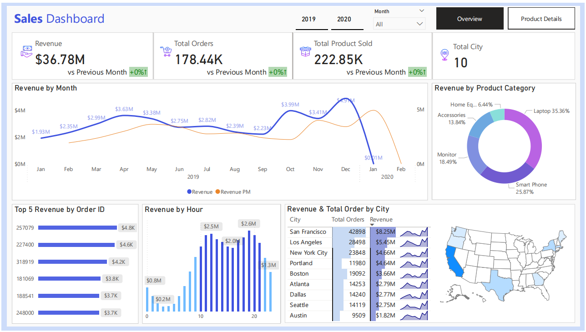
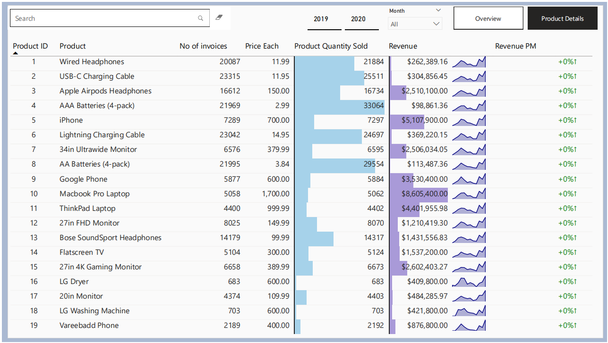

# 📊 Sales Data Analyst Project

This repository contains code and analysis for sales data. The analysis is divided into several sections, each of which is described in detail below.

---

## 🚀 Getting Started

### 📦 Importing Necessary Libraries
In this section, we import the required Python libraries to perform data analysis and visualization, including `pandas`, `numpy`, `matplotlib`, and `seaborn`.

---

## 📂 Loading Data

### 🧾 The Dataset
The dataset consists of **12 CSV files**, each representing sales details for a month in the year **2019**.  
Each file contains between **9,000** and **26,000** rows and includes the following columns:

- `Order ID`
- `Product`
- `Quantity Ordered`
- `Price Each`
- `Order Date`
- `Purchase Address`

---

## 🔧 Data Processing

Data processing involves cleaning and preparing the raw dataset for further analysis. This includes:

- Removing NaN or duplicate values
- Converting data types
- Extracting time and location features from the original columns

---

## 📈 Exploratory Data Analysis (EDA)

EDA is the heart of this project. It includes comprehensive visualizations and summaries that provide a better understanding of the data and help identify trends and patterns.

---

## 💰 Sales Analysis

### 📅 Best Month for Sales
We determine which month had the highest total sales and visualize the monthly revenue trends.

### 📆 What Day of the Week Has the Highest Sales?
We identify the weekday with the most sales and provide visual insights.

### 🕒 Timeline of Day of the Week vs. Revenue
We create a line chart to observe how revenue changes throughout the week.

### ⏰ Sales Per Hour
We analyze sales trends by the hour to identify peak buying times.

---

## 📦 Product Analysis

### 🛍️ What Product Sold the Most?
We determine the most frequently purchased product and analyze its pricing trends.

### 🏙️ Top Products for Each City
We identify the top-selling product in each city.

### 💸 Top 5 Products with the Highest Revenue for Each City
We list the top 5 revenue-generating products by city.

### 🔗 What Products Are Most Often Sold Together?
We explore product combinations frequently purchased in the same order.

### 📊 What Percentage of Orders Include Multiple Products?
We calculate the percentage of orders containing more than one product.

---

## 💳 Order Value Analysis

### 💵 What Was the Highest Single-Order Value?
We identify the highest value from a single order and analyze its contents.

---

## 🌆 City and Revenue Analysis

### 🏆 What City Has the Highest Revenue?
We determine which city generated the most sales revenue.

### 🏙️ What City Sold the Most Products?
We compare cities based on the total number of products sold.

---

## 🗺️ State Analysis

### 📍 What Is the Distribution of States?
We visualize and analyze how orders are distributed across U.S. states.

---

## ✅ Conclusion

In conclusion, our sales data analysis provides **actionable insights** that can guide strategic decisions across the business. These insights include:

- Identification of **peak sales months**
- **Best-selling products**
- **Top revenue-generating cities**
- Purchase behavior and buying patterns

These findings can help businesses **optimize operations**, **improve marketing strategies**, and **increase revenue**. Continuous monitoring and analysis of sales data are essential to stay competitive in a dynamic market environment.

---

## 📊 Power BI Dashboard
- Sales Dashboard
  

- Product Details Dashboard
    
---

## 📞 Contact
For questions or suggestions, reach out via nguyenquangphuc412@gmail.com 

---

Thank you for visiting this project! ⭐